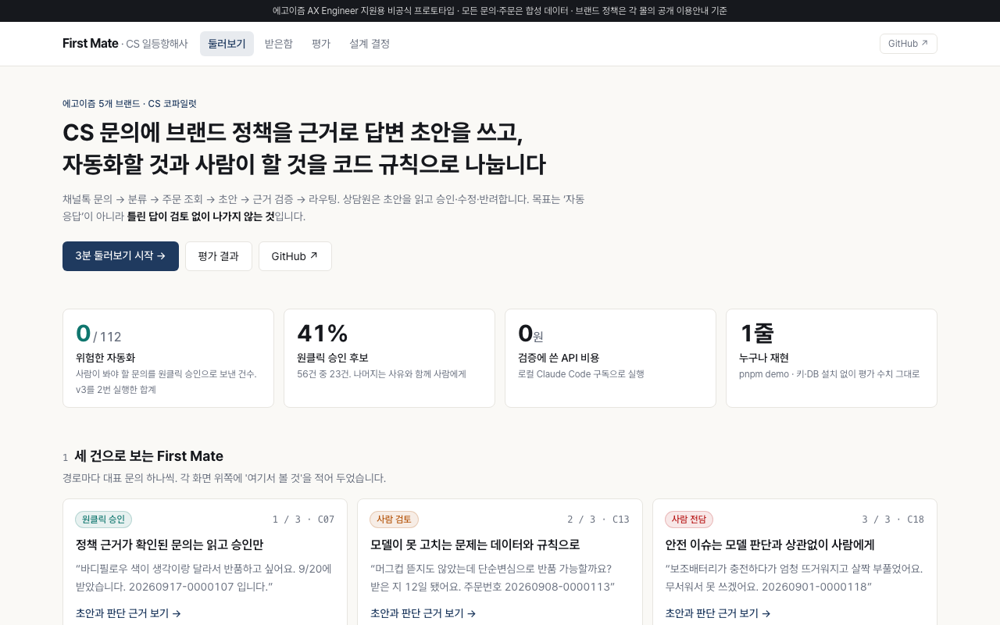
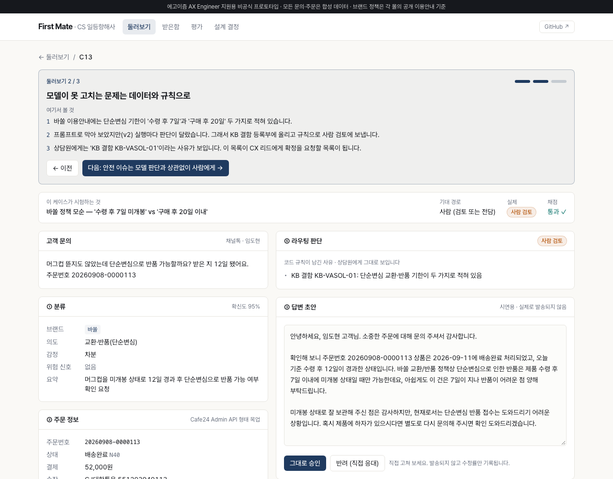

# First Mate — 에고이즘 CS 일등항해사

채널톡 CS 문의를 **분류 → 주문 조회 → 브랜드 정책 근거 초안 → 규칙 라우팅**까지 처리하고, 상담원이 초안을 승인·수정·반려하는 CS 코파일럿입니다.

> 에고이즘 AX Engineer 지원용 비공식 프로토타입입니다. 모든 문의·주문은 합성 데이터입니다.

**🔗 [포트폴리오](https://first-mate-three.vercel.app/portfolio.html) · [라이브 데모](https://first-mate-three.vercel.app) · [평가 결과](https://first-mate-three.vercel.app/eval)**

<table>
  <tr>
    <td><a href="https://first-mate-three.vercel.app"></a></td>
    <td><a href="https://first-mate-three.vercel.app/tickets/13?tour=2"></a></td>
  </tr>
  <tr>
    <td align="center">상담원 콘솔</td>
    <td align="center">문의 상세 — 라우팅 사유 · 초안 · 트레이스</td>
  </tr>
</table>

## 빠른 실행

API 키·Claude 구독·DB 설치 없이 평가 수치를 재현합니다.

```bash
git clone https://github.com/JIPGERIA/first-mate && cd first-mate
pnpm install
pnpm demo            # 골든 36 + 홀드아웃 20건 평가 재현 (약 10초)
pnpm demo --serve    # 이어서 콘솔을 localhost:3000에
```

`pnpm demo`는 내장 Postgres(PGlite)에서 기록해 둔 모델 응답(`data/replay/`)을 재생하고, 나머지 파이프라인은 실제 코드로 실행합니다.
프롬프트·KB·입력이 바뀌면 재생 기록이 없어 멈춥니다.

## 직접 모델 돌리기

Claude Code 로그인과 Postgres(`.env.local`의 `DATABASE_URL`)가 필요합니다.

```bash
pnpm seed                        # 스키마 + 합성 주문/문의
pnpm eval                        # 골든셋 처리 + 채점
EVAL_SET=holdout2 pnpm eval      # 홀드아웃
MOCK_FAULT_RATE=0.2 pnpm eval    # 주문 API 장애 20% 주입
LLM_RECORD=1 pnpm eval           # 응답을 data/replay에 기록 (pnpm demo용)
pnpm summary                     # 배치별 요약
pnpm trace C13                   # 케이스 트레이스
pnpm dev
```

## 구조

```
src/lib/pipeline/        분류 · 초안 프롬프트, 라우팅 규칙, 오케스트레이션
src/lib/llm/             LLMProvider — claude-code(구독, 기록) · replay(재생)
src/lib/commerce/        Cafe24 Admin API 목업 + 재시도 클라이언트
src/lib/decisions.ts     설계 결정(ADR) 10개
src/app/                 콘솔 — 둘러보기 · 받은함 · 문의 상세 · 평가 · 설계 결정
data/kb/                 브랜드별 정책 KB, KB 결함 등록부(_issues.json)
data/eval/               golden · holdout · holdout2 · 채점 규칙 CHANGELOG
data/replay/             기록된 모델 응답
db/schema.sql            orders · tickets · runs · steps · reviews · eval_results
scripts/                 demo · seed · eval · summary · trace
public/portfolio.html    지원 포트폴리오
```

**Stack** Next.js 16 · TypeScript · Postgres · Zod · Claude (Haiku 4.5 분류 / Sonnet 5 초안)
